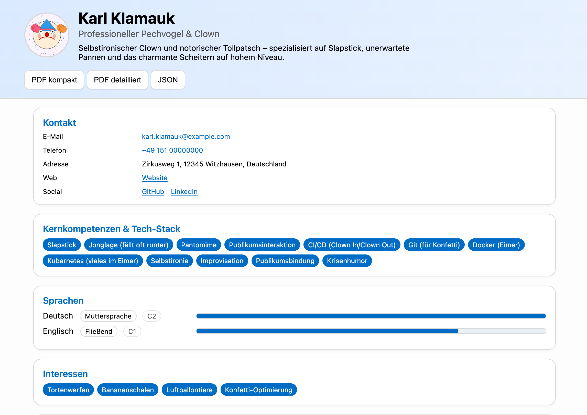

# resume-web

**Static web frontend for JSON-based resumes with PDF export.**

This project renders a modern resume directly from a `cv.json` file.  
It is designed to be hosted statically (e.g. via GitHub Pages, GitLab Pages, or AWS S3).



[Here](https://slauger.github.io/resume-web/) you can find and example, hosted on GitHub Pages.

---

## ✨ Features

- Load resume data from a single `cv.json`
- Clean, modern web design
- Expandable details for each experience
- Skill tags displayed as badges
- Language levels with progress bars
- PDF export (compact and detailed version)
- Optional raw JSON download

---

## 📂 Project structure

```
html/
├── index.html       # Main entry point
├── styles.css       # Styling
├── script.js        # Data loading and rendering
├── cv.json          # Your resume data
└── profile.jpg      # Profile picture
```

---

## 🔧 How to use

1. Clone this repository:
   ```bash
   git clone https://github.com/<your-username>/resume-web.git
   cd resume-web
   ```

2. Replace `cv.json` and `profile.jpg` with your own data and image.

3. Open `index.html` locally in a browser **or** host it on:
   - **GitHub Pages**: Push to `main` and enable Pages in repo settings  
   - **GitLab Pages**: Use a simple static site config  
   - **S3/CloudFront**: Upload files and enable static website hosting  

---

## 📝 JSON structure

Top-level fields in `cv.json`:

- `name`: Full name  
- `title`: Professional title (e.g. *Cloud Consultant*)  
- `image`: Path to profile picture  
- `contact`: Address, email, phone, web  
- `socialLinks`: List of `{ name, url }`  
- `description`: Short profile summary  
- `skills`: Array of strings (tags)  
- `languages`: Object `{ "English": { "level": 85, "label": "Fluent", "cefr": "C1" } }`  
- `interests`: Array of strings  
- `experience`: Array of experience objects  
- `education`: Array of education objects  
- `certificates`: Array of certificates  

---

## 📄 License

MIT – free to use, modify and share.
